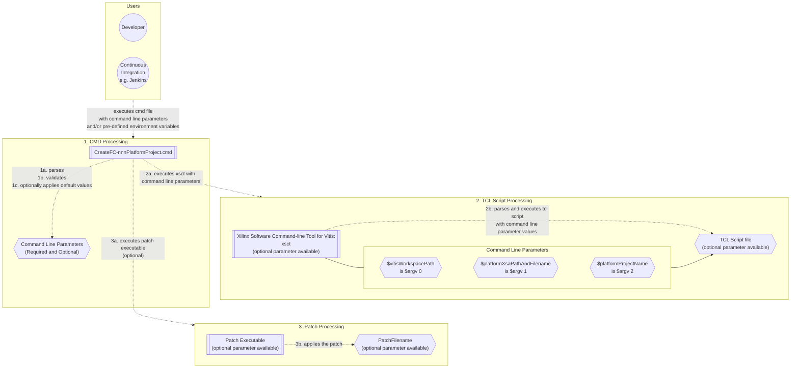
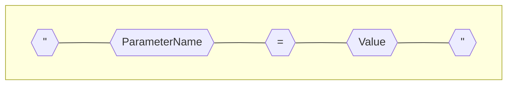
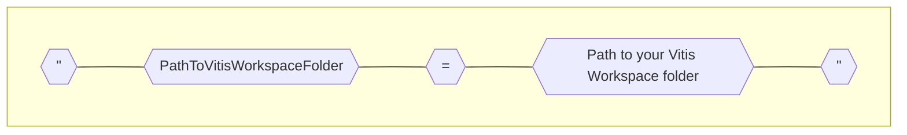
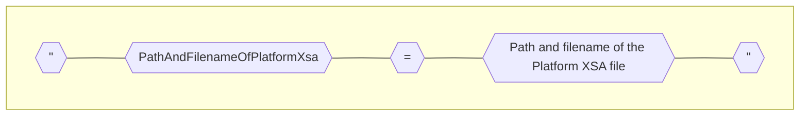
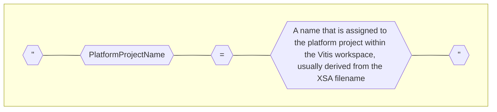
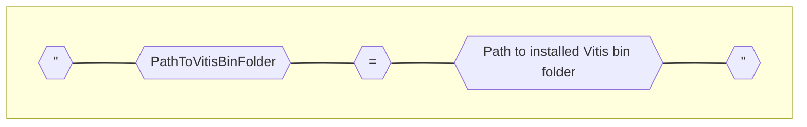
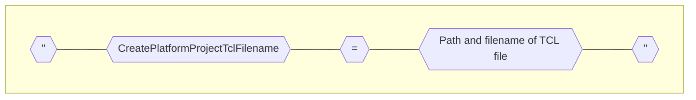
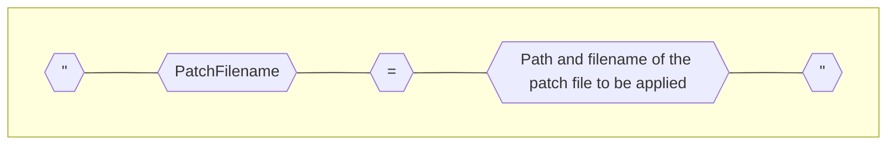
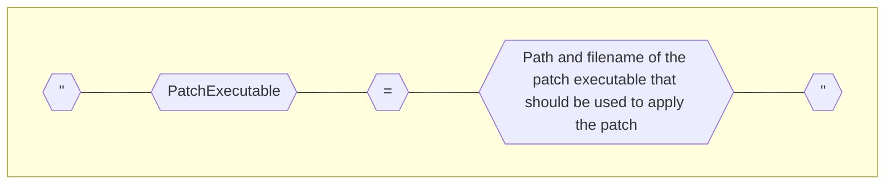

# Usage information for CreateFC-nnnPlatformProject.cmd and corresponding TCL script files

- Where nnn refers to the FC LRU type variant (100, 200, etc)

## Introduction
- Each cmd file will by default expect a corresponding TCL file to be present in the same folder as the cmd file

## About the CreateFC-nnnPlatformProject.tcl files
The tcl files are intended to be specific to the FC LRU type variant (the target platform).

The tcl script files are parsed by xsct (the Xilinx Software Command-line Tool for Vitis), xsct executes the instructions contained in the tcl script file.

The tcl script filename can be specified using an optional command line parameter to the cmd file, when not specified the tcl filename is derived from the cmd filename.

## About the CreateFC-nnnPlatformProject.cmd files
The cmd files are designed and intended to:
- Allow for separation between target platform variants such that divergent changes are isolated in separate files
- Never require any editing by the user (please do not edit, ask for help if anything is unclear)
- Never require any editing when a new platform xsa file is available
- Accept inputs from the user or Continuous Integration as command line parameters
- Allow the user or CI to use an alternate method of specifying one or more parameter values using environment variables in a user-defined batch file
- Allow for required and optional parameters
- Allow for using a default value when an optional parameter is not specified
- Allow the user to specify command line parameters in any order such that the sequential ordering of parameters is irrelevant
- Allow for installation folder path variations where default installation folders have not been used

## How to specify CreateFC-nnnPlatformProject.cmd command line parameters
- Each command line parameter starts and ends with double quotation marks, using the following syntax:

- Where the rules for ParameterName are the same rules applicable to environment variable names
- Parameters must be separated by a space character, for example: "ParameterXName=XValue" "ParameterYName=YValue"

## CreateFC-nnnPlatformProject.cmd Required Parameters
- The following parameters must be provided, either using the abovementioned command line parameter syntax, or pre-defined using environment variables prior to calling CreateFC-nnnPlatformProject.cmd:

## CreateFC-nnnPlatformProject.cmd Optional Parameters
- The following parameters are optional and will use a default value if not specified prior to calling CreateFC-nnnPlatformProject.cmd:

